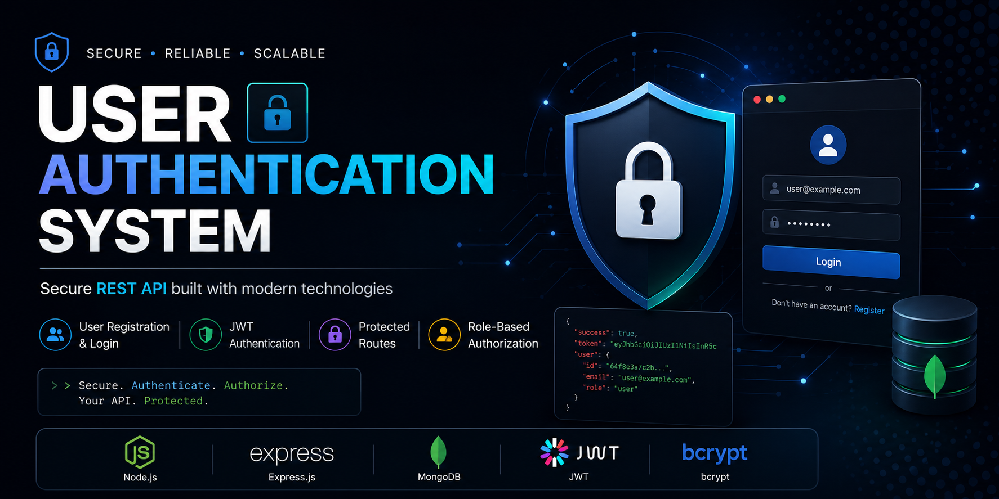

<p align="center">
  
</p>

# 🔐 User Authentication System


A secure and scalable REST API built using **Node.js**, **Express.js**, **MongoDB**, **JWT**, and **bcrypt**.

---

## 🚀 Features

- ✅ User Registration
- ✅ User Login
- ✅ JWT Authentication
- ✅ Protected Routes
- ✅ Password Hashing
- ✅ Role-Based Authorization
- ✅ Email Validation
- ✅ Password Validation
- ✅ Logout API
- ✅ CRUD Operations
- ✅ MongoDB Integration
- ✅ RESTful API Design

---

## 🛠 Tech Stack

- Node.js
- Express.js
- MongoDB
- Mongoose
- JWT
- bcrypt
- dotenv

---

## 📂 Project Structure

```text
User Authentication System/
│
├── assets/
│   └── banner.png
├── config/
├── controllers/
├── middleware/
├── models/
├── routes/
├── .gitignore
├── package.json
├── README.md
└── server.js
```

---

## ⚙️ Installation

### Clone the repository

```bash
git clone https://github.com/Princekasaudhan-web/USER_Authentication_System.git
```

### Navigate to the project

```bash
cd USER_Authentication_System
```

### Install dependencies

```bash
npm install
```

### Create a `.env` file

```env
PORT=5000
MONGO_URI=your_mongodb_connection_string
JWT_SECRET=your_secret_key
```

### Start the development server

```bash
npm run dev
```

---

## 🔐 Authentication

Use a JWT token for protected routes.

```text
Authorization: Bearer YOUR_JWT_TOKEN
```

---

## 📌 API Endpoints

| Method | Endpoint | Description |
|--------|----------|-------------|
| POST | `/api/auth/register` | Register User |
| POST | `/api/auth/login` | Login User |
| POST | `/api/auth/logout` | Logout User |
| GET | `/api/users` | Get All Users |
| GET | `/api/users/:id` | Get User by ID |
| PUT | `/api/users/:id` | Update User |
| DELETE | `/api/users/:id` | Delete User |

---

## 🔒 Security Features

- Password Hashing using bcrypt
- JWT Authentication
- Protected Routes
- Role-Based Access Control
- Environment Variables
- Email Validation
- Strong Password Validation

---

## 📈 Future Improvements

- Email Verification
- Forgot Password
- Reset Password
- Refresh Token
- Docker Support
- Swagger API Documentation
- Unit Testing (Jest)
- Two-Factor Authentication (2FA)

---

## 📸 API Screenshots

### 👤 User Registration


---

### 🔑 User Login


---

### 👤 User Profile (Protected Route)


## 👨‍💻 Author

**Prince Kasaudhan**

GitHub:  
https://github.com/Princekasaudhan-web

---

## ⭐ Support

If you found this project helpful, please consider giving it a **⭐ Star** on GitHub.